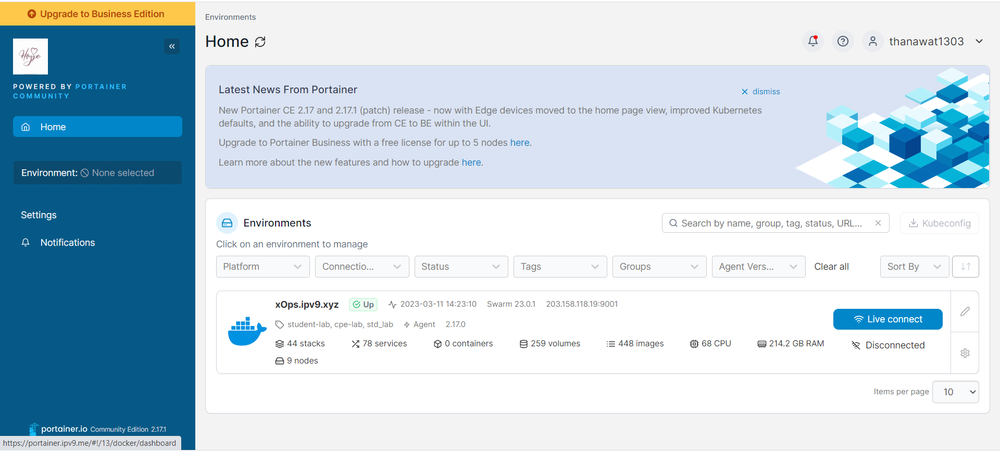
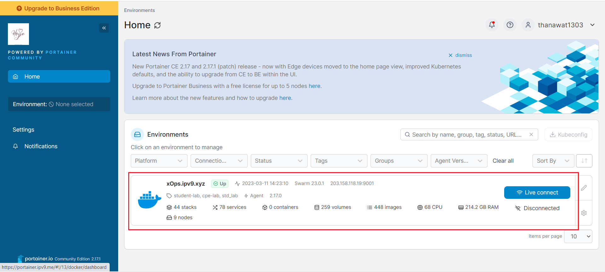
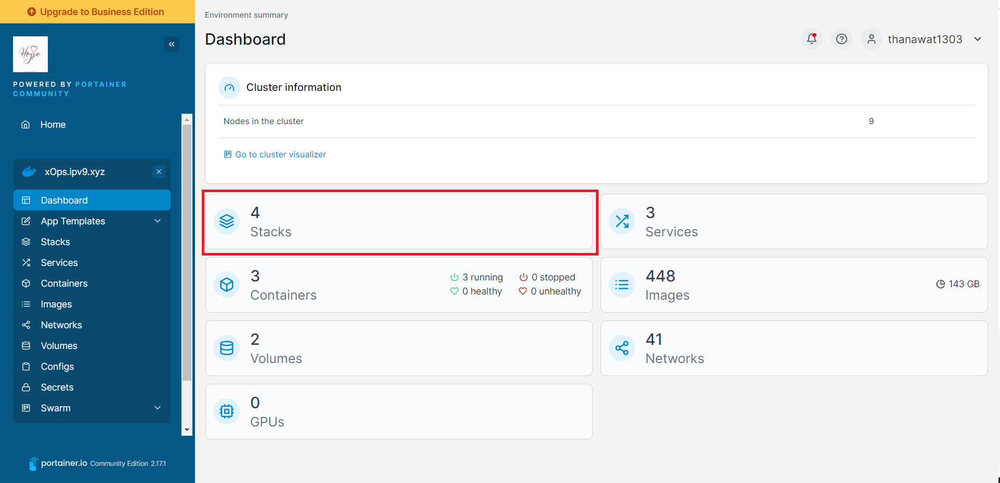
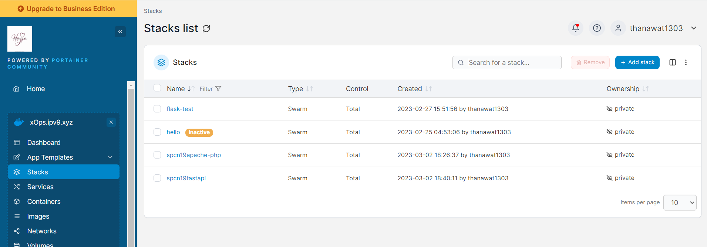
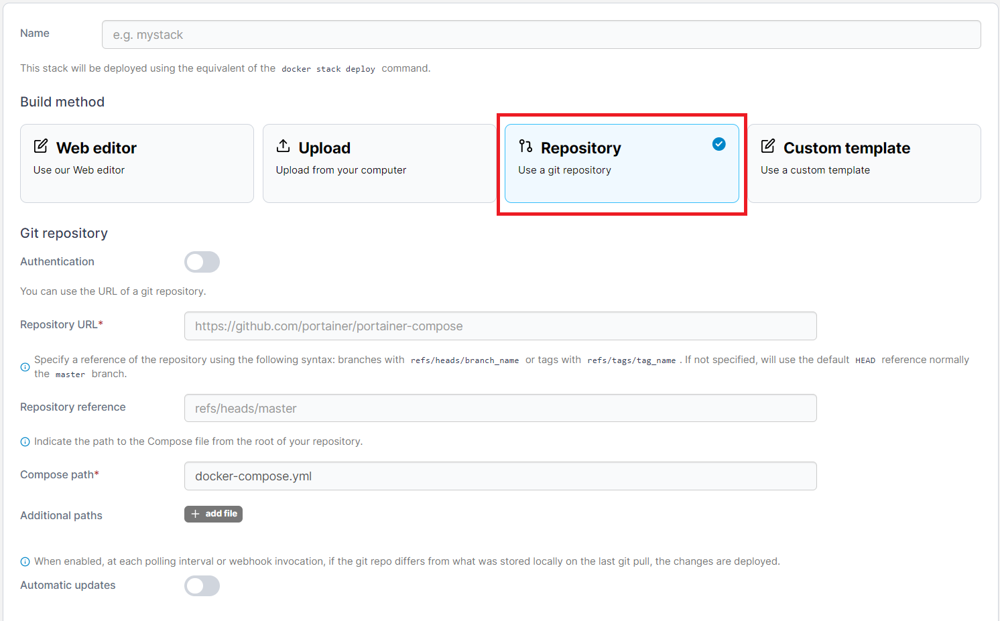

# swarm02 fastapi

### Ref awaresome-compose
- https://github.com/docker/awesome-compose/tree/master/fastapi

### Wakatime project
- https://wakatime.com/@spcn19/projects/iickecxaxq

### Url fastapi app
- https://spcn19fastapi.xops.ipv9.xyz

### Step on Work
 1. Create folder swarm02 and Open folder on VScode
 2. Create folder app
 3. [Create Image from Dockerfile](#create-image-from-dockerfile)
 4. Create docker-compose.yml `spcn19fastapi`
    <details>
    <summary>Show code</summary>

    ```ruby
    version: '3.3' #version compose must than 3 
    services: 
      api: #name application
        image: thanawat1303/fastapi-main:v1 #image service on dockerhub
        networks: #network in service
        - webproxy #network traefik
        environment: #environment application
          PORT: 8000 
        logging:
          driver: json-file #type file 
        volumes: #mount data volume of container
          - /var/run/docker.sock:/var/run/docker.sock
          - app:/app #"path data on host" : "path data on container"
        restart: 'no'
        deploy: #set deploy for swarm
          replicas: 1 #set amount worker want deploy container
          labels: #set labels application connect Traefik
            - traefik.docker.network=webproxy #name network of Traefik
            - traefik.enable=true #status of connect
            - traefik.constraint-label=webproxy #select traefik want container working
            - traefik.http.routers.spcn19fastapi-https.entrypoints=websecure #set position when have request to traefik
            - traefik.http.routers.spcn19fastapi-https.rule=Host("spcn19fastapi.xops.ipv9.xyz") #set domain access to application
            - traefik.http.routers.spcn19fastapi-https.tls.certresolver=default #set certresolver
            - traefik.http.services.spcn19fastapi.loadbalancer.server.port=8000 #set balance when request to port on container
            - traefik.http.routers.spcn19fastapi-https.tls=true #set status Protocal TLS
          resources: #set space that want of Container
            reservations: #set low space
              cpus: '0.1' 
              memory: 10M
            limits: #set high space
              cpus: '0.4'
              memory: 250M
              
    networks: #set networks outside container
      webproxy: #service network revert proxy on cluster
        external: true
    volumes: #volumes on host of Docker
      app:
    ```

    </details>
 5. <details>
    <summary>Show file structure in work</summary>

    ```ruby
    |__.app
        |__.Dockerfile
        |__.main.py
        |__.requirements.txt
    |__.docker-compose.yml
    ```

    </details> 
 6. Push file to github swarm02
 7. Open https://portainer.ipv9.me/

<div align="center"></div>

 8. Click Cluster Xopx.ipv9.xyz on Portainer

<div align="center"></div>

 9. Click menu Stack on Cluster Xopx.ipv9.xyz

<div align="center"></div>

 10. Click button Add Stack

<div align="center"></div>

 11. Click Build medthod is Repository

<div align="center"></div>

  - Name = name Stack
  - Repository URL = https://github.com/thanawat1303/swarm02
  - Repository reference = refs/heads/main
  - Compose path = name Compose file
  - Automatic updates = enable
    - Fetch interval = time check change on compose file from github 
    
 12. Click button Deploy the stack

### Create Image from Dockerfile
 1. Create main.py in /app
    <details>
    <summary>Show code</summary>

    ```python
    from fastapi import FastAPI

    app = FastAPI()

    @app.get("/")
    def hello_world():
        return {"message": "ผมรักวิชานี้ SPCN19"}
    ```

    </details>
 2. Create requirements.txt in /app
    <details>
    <summary>Show code</summary>

    ```ruby
    fastapi
    uvicorn
    ```

    </details>
 3. Create Dockerfile in /app
    <details>
    <summary>Show code</summary>

    ```dockerfile
    FROM tiangolo/uvicorn-gunicorn-fastapi:python3.9-slim AS builder #image container

    WORKDIR . #Set path working command on container

    COPY requirements.txt ./ #Copy file on host to container
    RUN --mount=type=cache,target=/root/.cache/pip \
        pip install -r requirements.txt #run command on container

    COPY . ./app/ #Copy file on host to container

    FROM builder as dev-envs

    RUN <<EOF
    apt-get update
    apt-get install -y --no-install-recommends git
    EOF

    RUN <<EOF
    useradd -s /bin/bash -m vscode
    groupadd docker
    usermod -aG docker vscode
    EOF
    # install Docker tools (cli, buildx, compose)
    COPY --from=gloursdocker/docker / /
    ```

    </details>
 4. Build image from Dockerfile
 
    ```
    docker build <path dockerfile> -t <usernameDockerHub>/<repo>:<tag> #thanawat1303/fastapi-main:v1
    ```
 5. Push image to DockerHub

     ```
     docker push <image ID> <usernameDockerHub>/<repo>:<tag> #thanawat1303/fastapi-main:v1
     ```